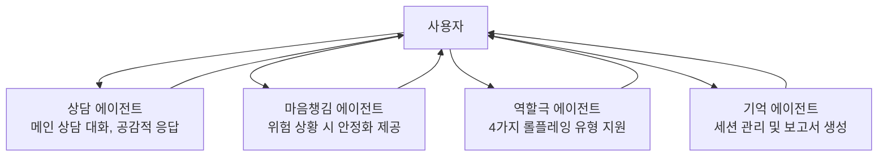

# 멀티에이전트 상담 시스템 - 사용자 중심 다이어그램

## 사용자 중심 에이전트 구조

## 사용자와의 상호작용

### 사용자 → 에이전트들
- **사용자**가 상담을 시작하면 **상담 에이전트**가 응답
- **사용자**가 위험한 상황을 표현하면 **마음챙김 에이전트**가 개입
- **사용자**가 특정 상황을 연습하고 싶으면 **역할극 에이전트**가 도움
- **사용자**의 세션이 끝나면 **기억 에이전트**가 정리

### 에이전트들 → 사용자
- 모든 에이전트는 **사용자**에게 직접 응답
- 각 에이전트는 자신의 전문 영역에서 **사용자**를 지원
