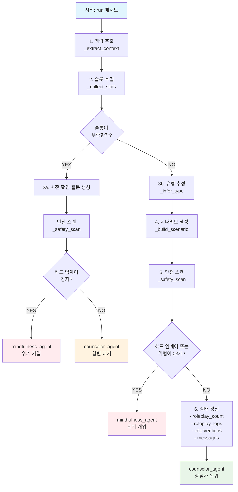
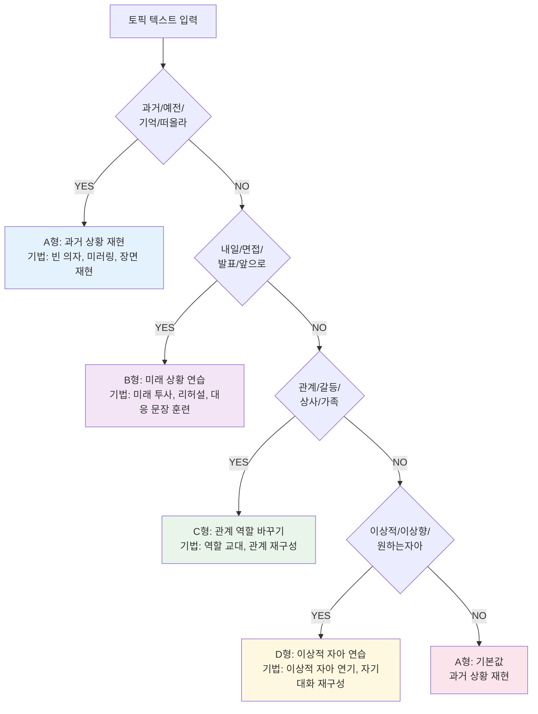
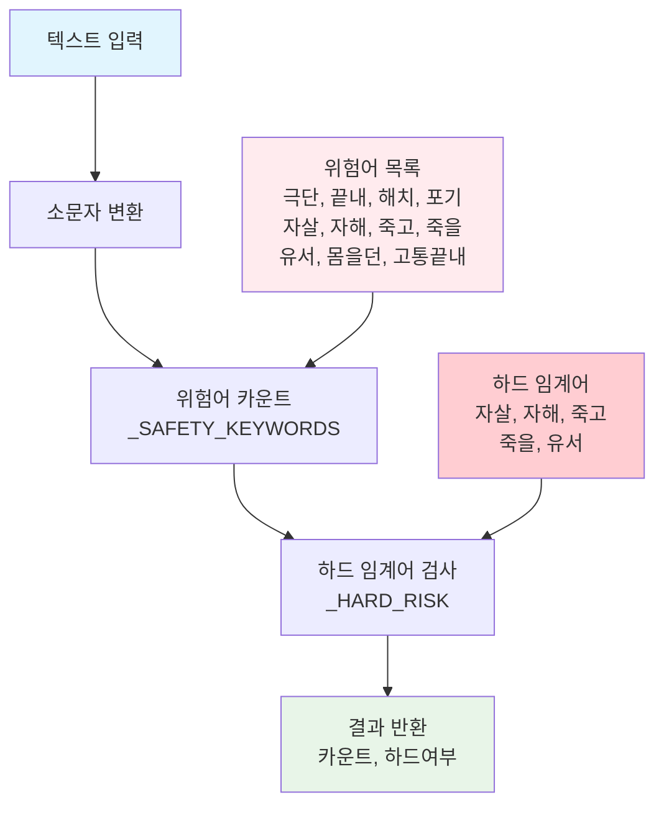
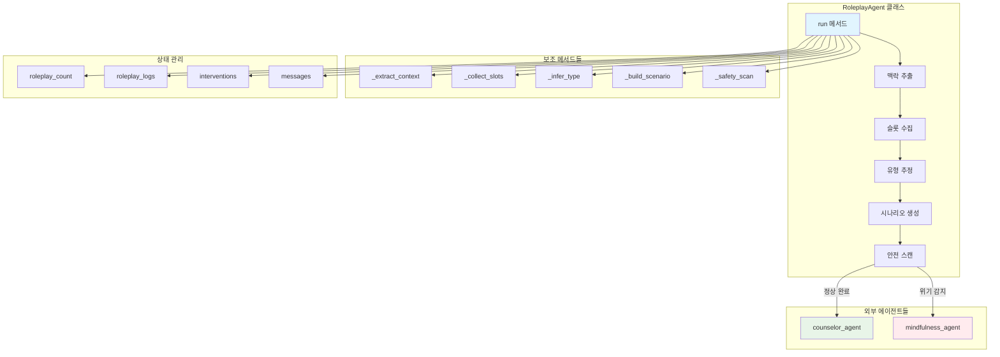

# RoleplayAgent 워크플로우 - Mermaid 다이어그램

아래 Mermaid 코드를 [Mermaid Live Editor](https://mermaid.live/)에 복사하여 시각적 다이어그램을 확인하세요!

## 메인 실행 흐름



## 유형 분류 로직



## 안전 스캔 프로세스



## 시나리오 생성 구조

```mermaid
flowchart TD
    A[입력 파라미터<br/>rtype, persona<br/>slots, ctx_text] --> B[유형별 기법 선택<br/>_TECHNIQUE_BY_TYPE]
    B --> C[GPT 프롬프트 구성<br/>- 페르소나<br/>- 유형/기법<br/>- 상담 맥락<br/>- 슬롯 정보]
    C --> D[GPT-4o 호출<br/>시나리오 생성]
    D --> E[3단계 템플릿<br/>1) 안전수칙<br/>2) 준비→연기<br/>3) 정리]
    
    F[페르소나 프리셋<br/>공감적 상담자<br/>단호한 코치<br/>따뜻한 친구<br/>과거의 나<br/>이상적 자아] --> C
    
    style A fill:#e1f5fe
    style E fill:#e8f5e8
    style F fill:#f3e5f5
```

## 전체 시스템 아키텍처



## 사용 방법

1. [Mermaid Live Editor](https://mermaid.live/)에 접속
2. 위의 Mermaid 코드 중 하나를 복사
3. 에디터에 붙여넣기
4. 시각적 다이어그램 확인!

각 다이어그램은 RoleplayAgent의 다른 측면을 보여줍니다:
- **메인 실행 흐름**: 전체적인 실행 순서와 분기점
- **유형 분류 로직**: A/B/C/D 유형 결정 과정
- **안전 스캔 프로세스**: 위험어 감지 메커니즘
- **시나리오 생성 구조**: GPT를 통한 시나리오 생성 과정
- **전체 시스템 아키텍처**: 클래스 간 관계와 데이터 흐름
